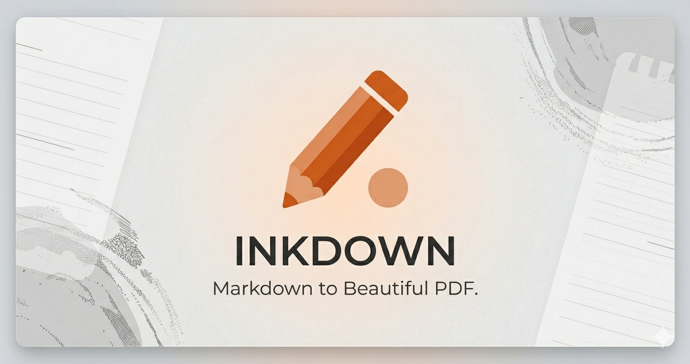

# InkDown

InkDown is an advanced, privacy-first, purely client-side Markdown editor built to deliver a word-processor-like experience natively inside your browser. By decoupling Markdown editing from standard web paradigms and merging it into a highly configurable desktop-like interface, InkDown produces beautiful continuous outputs ready for direct native PDF and HTML exports.



## Core Philosophy
- **Local-First & Private:** Everything processes client-side. There are absolutely zero servers storing your document keystrokes or layout structures. Documents auto-save seamlessly to `localStorage`.
- **Pixel-Perfect PDF Exports:** The application leverages CSS print media queries and custom Tailwind hooks to eject standard UI canvases, rendering your markdown inside perfect physical page bounds (A4, Letter, etc.) letting browser engines do the heavily lifting for PDF delivery.
- **Component Based Configurations:** Rather than maintaining massive markdown headers, everything is customized interactively. Fonts, typographies, syntax highlighting engines, global colors, and markdown feature-flags are stored in local Zustand stores and applied instantaneously to your preview layouts via an injected `<style>` tag.

## Core Features

### Advanced Markdown Pipeline
At the core of InkDown is a hyper-optimized unified AST parsing pipeline extending far beyond standard Markdown structures.
- **Syntax Highlighting**: Real-time multi-language parsing generated internally via Shiki with customizable themes.
- **Math Block Targeting**: LaTeX compilation native via KaTeX matching (`$` and `$$` boundaries).
- **GitHub Callouts & Alerts**: Translates standard `> [!WARNING]` blockquote styles into beautiful, colored CSS components.
- **Automated Mermaid Flowcharts**: Direct compilation of Mermaid graph text natively into scalable SVG diagrams.

### Professional Quality-of-Life (QoL)
- Drag-and-drop or URL-fetch directly into the editor for instant `.md`/`.txt` document imports.
- Robust state keyboard bindings (`Ctrl+S`, `Ctrl+Z`, `Ctrl+\` to toggle sidebar, `Ctrl+Shift+F` for focus mode, `Alt+1/2/3` for layout views).
- Intelligent document structural processing including automated dynamic Table of Contents injections and Header numbering based on document heading graphs.
- Full Custom Presets enabling downloading serialized JSON blobs formatting your CSS preferences.

## Technology Stack
- **Framework**: [Next.js 15](https://nextjs.org/) (App Directory, Turbopack)
- **UI & Layout Structure**: [React 19](https://reactjs.org), [Tailwind CSS v4](https://tailwindcss.com/)
- **Components Component Library**: shadcn/ui featuring headless @base-ui primitives alongside robust `react-resizable-panels`.
- **State Management**: `zustand` featuring multi-store chunking bindings syncing aggressively to browser `persist` arrays.
- **Markdown Architecture**: `codemirror` (v6) editing alongside `unified.js` (`remark`/`rehype` abstractions) with custom `unist-util-visit` hast parsers handling specific injections.

## Quickstart Guide

### Pre-requisites
Make sure you have `pnpm` and Node.js installed (> v18.x.x recommended).

### Install & Launch
Run the following commands:
```bash
# Clone the repository
git clone https://github.com/DhavalDudheliya/InkDown.git
cd inkdown

# Native dependency resolution
pnpm install

# Start the NextJS 15 dev server using Turbopack
pnpm dev
```
Navigate to `http://localhost:3000/editor` to access the full editor UI.

## Deployment Process

Deploying InkDown is completely self-contained since its entire processing architecture operates inside standard browser APIs (`window.print()`, `URL.createObjectURL()`, `localStorage`).
Deploy as a static web application to Vercel, Netlify, or Cloudflare Pages instantly using standard Next.js building rules.

```bash
pnpm run build
pnpm run start
```

## Available Scripts

- `pnpm dev` - Starts the development server using Turbopack
- `pnpm build` - Creates an optimized production build
- `pnpm start` - Starts the Next.js production server
- `pnpm lint` - Runs Biome/ESLint checks across all files

## Future Roadmap

- Expanding Preset storage mechanisms via IndexedDB mapping limits for larger profiles.
- Enabling multi-document tabbing to edit concurrent document strings simultaneously without overwriting active storages. 

Enjoy exploring the frontier of lightweight web typography with InkDown!
