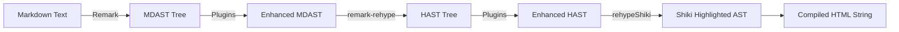
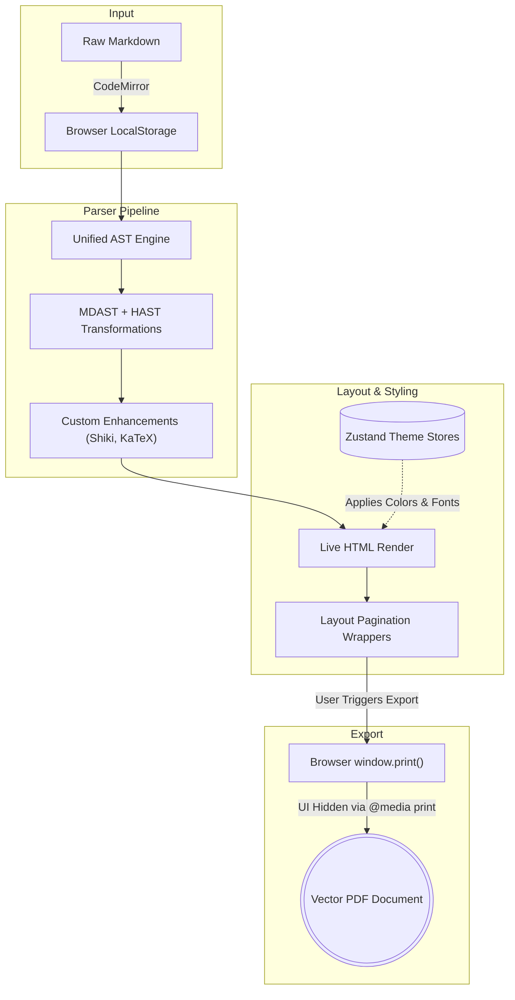

# InkDown: Complete Data Flow & Feature Guide (Markdown to PDF)

InkDown (or MarkFlow PDF Studio) is an advanced, privacy-first, purely client-side Markdown editor designed to deliver professional, word-processor-like PDFs natively entirely within the browser.

This document details the complete flow of data from the moment a user inputs Markdown text to the final generation of a high-fidelity PDF, focusing extensively on the specialized Markdown parsing, styling, and export features.

---

## 1. The Beginning: Content Ingestion & State
The flow starts when the user introduces Markdown content into the system.
- **Input Methods**: Users can type directly into the CodeMirror 6 based editor, drag-and-drop `.md`/`.txt` files, fetch files from a URL, or load from recent browser history.
- **State Management**: The application is fully client-side. Content, structure, and user keystrokes are immediately captured and stored in the browser's `localStorage` via Zustand stores. There is zero server-side processing for the document contents.

## 2. The Core Engine: Markdown Parsing Pipeline
As the user types, the application passes the raw Markdown through a highly optimized, custom **Unified AST (Abstract Syntax Tree)** parsing pipeline. This stage transforms basic Markdown tokens into robust, semantic UI elements.



**The Pipeline Flow**:
1. **Remark Parsing**: Converts raw Markdown text into an MDAST (Markdown Abstract Syntax Tree).
2. **Remark Plugins**: Applies plugins like `remark-gfm` for advanced GitHub-Flavored Markdown (tables, task lists, strikethrough) and `remark-math` for LaTeX block structures.
3. **AST Transformation**: Converts the MDAST to HAST (HTML Abstract Syntax Tree) via `remark-rehype`.
4. **Rehype Enhancements**:
   - `rehype-katex`: Renders mathematical expressions into standard HTML/CSS.
   - `rehype-slug`: Auto-generates predictable IDs for headings, which is essential for Table of Contents navigation and internal linking.
5. **Custom `rehypeShiki` Plugin (Syntax Highlighting)**:
   - Instead of rendering standard HTML code blocks, this custom plugin intercepts `<pre><code>` nodes within the HAST.
   - It utilizes the **Shiki** engine (loading VS Code tokenizer themes that match the global app theme) to generate flawlessly highlighted HTML.
   - **AST Re-integration**: Because Shiki outputs an HTML string, the plugin uses `rehype-parse` to accurately convert the string back into a HAST tree. This crucial step prevents the pipeline from breaking and integrates the code block natively into the Unified tree structure.
   - **Code Block Enhancements**: It wraps line content in `.line-number` classes if line-numbering is enabled, and parses file names (e.g., ` ```typescript:main.ts `) to inject clean `.code-block-header` UI components above the code.
6. **Final Processing**: The plugin pipeline stringifies the HAST into final HTML that React and Next.js instantly render into the live preview panel.

## 3. Specialized Layout & Rendering Features
While the parser handles the text content, InkDown applies a dynamic design system to format the layout for physical pagination.

- **Theme & Typography Engine**: Local Zustand stores hold exact user typography and color choices. Google Fonts are dynamically loaded for specific text roles (Headings, Body, Monospace). Headings can be individually styled with distinct spacing, borders, weights, and letter spacings.
- **GitHub Callouts**: Translates standard `> [!WARNING]` or `> [!TIP]` blockquotes into beautifully tinted CSS banners with appropriate icons.
- **Mermaid Diagrams**: Compiles embedded Mermaid graph text (flowcharts, sequence charts) into scalable, native SVGs.
- **Document Structuring**: 
  - Generates an automated **Cover Page** (Title, Author, Subtitle, Date, Abstract).
  - Inspects the heading structure to inject an automated **Table of Contents (ToC)** with dot leaders and aligned page references.
  - Optionally injects hierarchical document numbering (e.g., 1., 1.1, 1.1.2) natively onto the headings.
- **Pagination Emulation**: The HTML output is continuously wrapped in containers designed to emulate physical constraints (A4, US Letter, Custom Margins), so the preview exactly matches the physical output.
- **Headers & Footers**: Dynamically renders configurable 3-zone (left, center, right) headers and footers containing logos, text, and dynamic page counts. 

## 4. The End: PDF Export Strategies
The ultimate goal of InkDown is to export the live preview workspace as a perfect PDF. The application has implemented specific strategies to overcome web-to-PDF formatting challenges.

### The Vector-Based Export (Current Method)
InkDown utilizes **Browser Print (`window.print()`)** to generate the final vector-based PDF.
- **Why Vector?**: Early implementations explored image-based libraries (`html2pdf.js` and `html2canvas`). While these matched complex CSS Layouts perfectly, the text in the resulting PDF was completely flattened. The PDFs were not searchable, and text was unselectable. The vector-based native print approach guarantees native text selectability, maintains sharp web fonts, and ensures minimal file sizes.
- **The Process**:
  1. The user clicks Export.
  2. Targeted `@media print` CSS rules dynamically hide all editor UI components (Sidebars, Editors, Topbars).
  3. Only the specific `preview-page-wrapper` containing the rendered document is promoted to the browser's print dialog.
  4. The browser's native PDF generation engine finalizes the file.

### Overcoming Modern CSS Limitations
Modern frameworks like Tailwind CSS v4 rely heavily on dynamic CSS color functions (like `oklch()` or `color-mix()`).
- Because PDF render engines sometimes struggle with advanced CSS color functions, InkDown converts root CSS variables for themes (like `:root` and `.dark` variables) to standard safe formats (`hsl` or `hex`).
- Workarounds such as the `onclone` DOM interceptor (originally used for html2canvas) or specific print-safe class substitutions ensure that complex styling—like syntax highlighting, blockquote shades, and container shadows—survive the export process flawlessly.

---

## Complete Data Timeline Summary



The data timeline transitions seamlessly from **Raw Markdown Input** within CodeMirror, goes through the **Unified AST Pipeline** for parsing, applies structured **Layouts and Themes** via Zustand, and concludes with a high-fidelity **Vector-Based PDF Export**.
